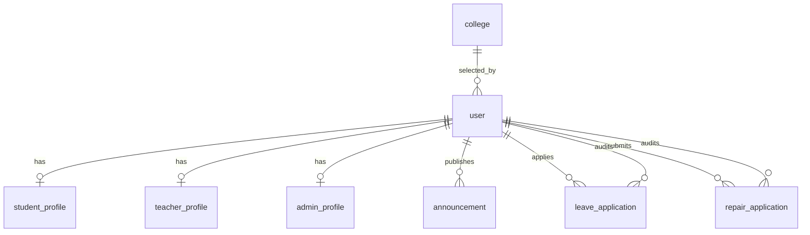

# CampusGo 数据库表结构设计

## 1. 数据库设计说明

数据库名称建议为 `campusgo`，字符集使用 `utf8mb4`，排序规则使用 `utf8mb4_unicode_ci`。

设计原则：

- 用户基础信息统一存放在用户表。
- 学生、教师、管理员的扩展信息分别存放在独立资料表。
- 学院信息由管理员维护，学生和教师只能选择系统中已启用的学院。
- 公告、请假、报修保留创建时间和更新时间。
- 删除公告建议采用逻辑删除。
- 业务状态使用字符串枚举，便于阅读和调试。

## 2. 表关系概览



## 3. 用户表 user

用于保存所有角色的登录账号和基础信息。

| 字段名 | 类型 | 约束 | 说明 |
| --- | --- | --- | --- |
| id | bigint | 主键，自增 | 用户 ID |
| username | varchar(50) | 非空，唯一 | 登录账号 |
| password | varchar(100) | 非空 | 加密后的密码 |
| role | varchar(20) | 非空 | STUDENT、TEACHER、ADMIN |
| real_name | varchar(50) | 非空 | 真实姓名 |
| phone | varchar(20) | 可空 | 手机号 |
| email | varchar(100) | 可空 | 邮箱 |
| college | varchar(100) | 可空 | 所属学院 |
| status | tinyint | 默认 1 | 1 正常，0 禁用 |
| created_at | datetime | 非空 | 创建时间 |
| updated_at | datetime | 非空 | 更新时间 |

```sql
CREATE TABLE user (
  id BIGINT PRIMARY KEY AUTO_INCREMENT,
  username VARCHAR(50) NOT NULL UNIQUE,
  password VARCHAR(100) NOT NULL,
  role VARCHAR(20) NOT NULL,
  real_name VARCHAR(50) NOT NULL,
  phone VARCHAR(20),
  email VARCHAR(100),
  college VARCHAR(100),
  status TINYINT NOT NULL DEFAULT 1,
  created_at DATETIME NOT NULL DEFAULT CURRENT_TIMESTAMP,
  updated_at DATETIME NOT NULL DEFAULT CURRENT_TIMESTAMP ON UPDATE CURRENT_TIMESTAMP
) ENGINE=InnoDB DEFAULT CHARSET=utf8mb4;
```

## 4. 学院表 college

用于保存系统可选择的学院字典。学院由管理员添加或修改，学生和教师注册、修改个人信息时只能从已启用学院中选择，避免自由输入导致学院名称不一致。

| 字段名 | 类型 | 约束 | 说明 |
| --- | --- | --- | --- |
| id | bigint | 主键，自增 | 学院 ID |
| name | varchar(100) | 非空，唯一 | 学院名称 |
| description | varchar(500) | 可空 | 学院说明 |
| status | tinyint | 默认 1 | 1 启用，0 停用 |
| created_at | datetime | 非空 | 创建时间 |
| updated_at | datetime | 非空 | 更新时间 |

```sql
CREATE TABLE college (
  id BIGINT PRIMARY KEY AUTO_INCREMENT,
  name VARCHAR(100) NOT NULL UNIQUE,
  description VARCHAR(500),
  status TINYINT NOT NULL DEFAULT 1,
  created_at DATETIME NOT NULL DEFAULT CURRENT_TIMESTAMP,
  updated_at DATETIME NOT NULL DEFAULT CURRENT_TIMESTAMP ON UPDATE CURRENT_TIMESTAMP
) ENGINE=InnoDB DEFAULT CHARSET=utf8mb4;
```

说明：当前课程项目可在 `user.college` 中保存学院名称快照，后端通过学院字典校验名称是否来自已启用学院。

## 5. 学生资料表 student_profile

| 字段名 | 类型 | 约束 | 说明 |
| --- | --- | --- | --- |
| id | bigint | 主键，自增 | 资料 ID |
| user_id | bigint | 非空，唯一，外键 | 用户 ID |
| student_no | varchar(30) | 非空，唯一 | 学号 |
| major | varchar(100) | 可空 | 专业 |
| class_name | varchar(100) | 可空 | 班级 |
| dorm_building | varchar(50) | 可空 | 公寓楼栋 |
| dorm_room | varchar(50) | 可空 | 宿舍号 |

```sql
CREATE TABLE student_profile (
  id BIGINT PRIMARY KEY AUTO_INCREMENT,
  user_id BIGINT NOT NULL UNIQUE,
  student_no VARCHAR(30) NOT NULL UNIQUE,
  major VARCHAR(100),
  class_name VARCHAR(100),
  dorm_building VARCHAR(50),
  dorm_room VARCHAR(50),
  CONSTRAINT fk_student_user FOREIGN KEY (user_id) REFERENCES user(id)
) ENGINE=InnoDB DEFAULT CHARSET=utf8mb4;
```

## 6. 教师资料表 teacher_profile

| 字段名 | 类型 | 约束 | 说明 |
| --- | --- | --- | --- |
| id | bigint | 主键，自增 | 资料 ID |
| user_id | bigint | 非空，唯一，外键 | 用户 ID |
| teacher_no | varchar(30) | 非空，唯一 | 工号 |
| title | varchar(50) | 可空 | 职称 |
| office | varchar(100) | 可空 | 办公室 |

```sql
CREATE TABLE teacher_profile (
  id BIGINT PRIMARY KEY AUTO_INCREMENT,
  user_id BIGINT NOT NULL UNIQUE,
  teacher_no VARCHAR(30) NOT NULL UNIQUE,
  title VARCHAR(50),
  office VARCHAR(100),
  CONSTRAINT fk_teacher_user FOREIGN KEY (user_id) REFERENCES user(id)
) ENGINE=InnoDB DEFAULT CHARSET=utf8mb4;
```

## 7. 管理员资料表 admin_profile

| 字段名 | 类型 | 约束 | 说明 |
| --- | --- | --- | --- |
| id | bigint | 主键，自增 | 资料 ID |
| user_id | bigint | 非空，唯一，外键 | 用户 ID |
| admin_no | varchar(30) | 非空，唯一 | 管理员编号 |
| department | varchar(100) | 可空 | 管理部门 |

```sql
CREATE TABLE admin_profile (
  id BIGINT PRIMARY KEY AUTO_INCREMENT,
  user_id BIGINT NOT NULL UNIQUE,
  admin_no VARCHAR(30) NOT NULL UNIQUE,
  department VARCHAR(100),
  CONSTRAINT fk_admin_user FOREIGN KEY (user_id) REFERENCES user(id)
) ENGINE=InnoDB DEFAULT CHARSET=utf8mb4;
```

## 8. 公告表 announcement

| 字段名 | 类型 | 约束 | 说明 |
| --- | --- | --- | --- |
| id | bigint | 主键，自增 | 公告 ID |
| title | varchar(200) | 非空 | 标题 |
| content | text | 非空 | 内容 |
| publisher_id | bigint | 非空，外键 | 发布人 ID |
| deleted | tinyint | 默认 0 | 0 正常，1 删除 |
| created_at | datetime | 非空 | 发布时间 |
| updated_at | datetime | 非空 | 更新时间 |

```sql
CREATE TABLE announcement (
  id BIGINT PRIMARY KEY AUTO_INCREMENT,
  title VARCHAR(200) NOT NULL,
  content TEXT NOT NULL,
  publisher_id BIGINT NOT NULL,
  deleted TINYINT NOT NULL DEFAULT 0,
  created_at DATETIME NOT NULL DEFAULT CURRENT_TIMESTAMP,
  updated_at DATETIME NOT NULL DEFAULT CURRENT_TIMESTAMP ON UPDATE CURRENT_TIMESTAMP,
  CONSTRAINT fk_announcement_publisher FOREIGN KEY (publisher_id) REFERENCES user(id)
) ENGINE=InnoDB DEFAULT CHARSET=utf8mb4;
```

## 9. 请假申请表 leave_application

| 字段名 | 类型 | 约束 | 说明 |
| --- | --- | --- | --- |
| id | bigint | 主键，自增 | 请假申请 ID |
| student_id | bigint | 非空，外键 | 学生用户 ID |
| college | varchar(100) | 非空 | 学院 |
| reason | varchar(500) | 非空 | 请假理由 |
| start_time | datetime | 非空 | 开始时间 |
| end_time | datetime | 非空 | 结束时间 |
| status | varchar(20) | 非空 | PENDING、APPROVED、REJECTED、CANCELED、RETURNED |
| auditor_id | bigint | 可空，外键 | 审核教师 ID |
| audit_opinion | varchar(500) | 可空 | 审核意见 |
| audit_time | datetime | 可空 | 审核时间 |
| return_time | datetime | 可空 | 销假时间 |
| created_at | datetime | 非空 | 申请时间 |
| updated_at | datetime | 非空 | 更新时间 |

```sql
CREATE TABLE leave_application (
  id BIGINT PRIMARY KEY AUTO_INCREMENT,
  student_id BIGINT NOT NULL,
  college VARCHAR(100) NOT NULL,
  reason VARCHAR(500) NOT NULL,
  start_time DATETIME NOT NULL,
  end_time DATETIME NOT NULL,
  status VARCHAR(20) NOT NULL DEFAULT 'PENDING',
  auditor_id BIGINT,
  audit_opinion VARCHAR(500),
  audit_time DATETIME,
  return_time DATETIME,
  created_at DATETIME NOT NULL DEFAULT CURRENT_TIMESTAMP,
  updated_at DATETIME NOT NULL DEFAULT CURRENT_TIMESTAMP ON UPDATE CURRENT_TIMESTAMP,
  CONSTRAINT fk_leave_student FOREIGN KEY (student_id) REFERENCES user(id),
  CONSTRAINT fk_leave_auditor FOREIGN KEY (auditor_id) REFERENCES user(id)
) ENGINE=InnoDB DEFAULT CHARSET=utf8mb4;
```

## 10. 报修申请表 repair_application

| 字段名 | 类型 | 约束 | 说明 |
| --- | --- | --- | --- |
| id | bigint | 主键，自增 | 报修申请 ID |
| student_id | bigint | 非空，外键 | 学生用户 ID |
| reason | varchar(500) | 非空 | 报修事由 |
| photo_url | varchar(255) | 可空 | 照片访问路径 |
| dorm_building | varchar(50) | 可空 | 公寓楼栋 |
| dorm_room | varchar(50) | 可空 | 宿舍号 |
| status | varchar(20) | 非空 | PENDING、APPROVED、REJECTED、CANCELED、REPAIRING、COMPLETED、RATED |
| auditor_id | bigint | 可空，外键 | 审核管理员 ID |
| audit_opinion | varchar(500) | 可空 | 审核意见 |
| audit_time | datetime | 可空 | 审核时间 |
| repairman_phone | varchar(20) | 可空 | 维修工手机号 |
| score | int | 可空 | 评分，1 到 5 |
| comment | varchar(500) | 可空 | 评价内容 |
| comment_time | datetime | 可空 | 评价时间 |
| created_at | datetime | 非空 | 申请时间 |
| updated_at | datetime | 非空 | 更新时间 |

```sql
CREATE TABLE repair_application (
  id BIGINT PRIMARY KEY AUTO_INCREMENT,
  student_id BIGINT NOT NULL,
  reason VARCHAR(500) NOT NULL,
  photo_url VARCHAR(255),
  dorm_building VARCHAR(50),
  dorm_room VARCHAR(50),
  status VARCHAR(20) NOT NULL DEFAULT 'PENDING',
  auditor_id BIGINT,
  audit_opinion VARCHAR(500),
  audit_time DATETIME,
  repairman_phone VARCHAR(20),
  score INT,
  comment VARCHAR(500),
  comment_time DATETIME,
  created_at DATETIME NOT NULL DEFAULT CURRENT_TIMESTAMP,
  updated_at DATETIME NOT NULL DEFAULT CURRENT_TIMESTAMP ON UPDATE CURRENT_TIMESTAMP,
  CONSTRAINT fk_repair_student FOREIGN KEY (student_id) REFERENCES user(id),
  CONSTRAINT fk_repair_auditor FOREIGN KEY (auditor_id) REFERENCES user(id)
) ENGINE=InnoDB DEFAULT CHARSET=utf8mb4;
```

## 11. 索引建议

```sql
CREATE INDEX idx_user_role ON user(role);
CREATE INDEX idx_college_status ON college(status);
CREATE INDEX idx_announcement_created_at ON announcement(created_at);
CREATE INDEX idx_leave_student_status ON leave_application(student_id, status);
CREATE INDEX idx_leave_college_status ON leave_application(college, status);
CREATE INDEX idx_repair_student_status ON repair_application(student_id, status);
CREATE INDEX idx_repair_status_created_at ON repair_application(status, created_at);
```

## 12. 初始数据建议

```sql
INSERT INTO user (username, password, role, real_name, phone, college)
VALUES ('admin', '加密后的密码', 'ADMIN', '系统管理员', '13800000000', NULL);
```

说明：实际开发时密码必须使用 BCrypt、MD5 加盐或其他加密方式生成后再入库，不能直接保存明文密码。
