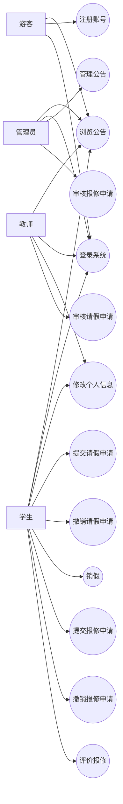
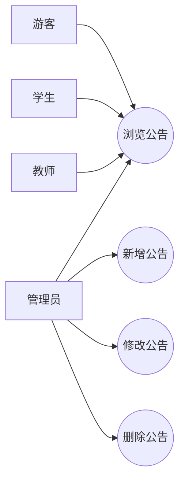
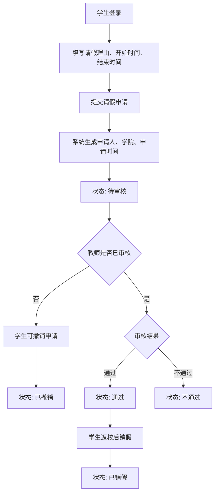
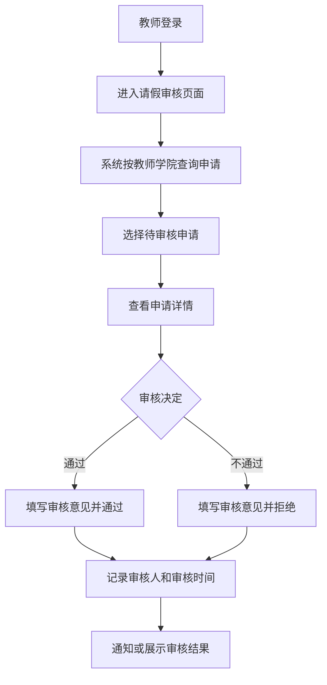
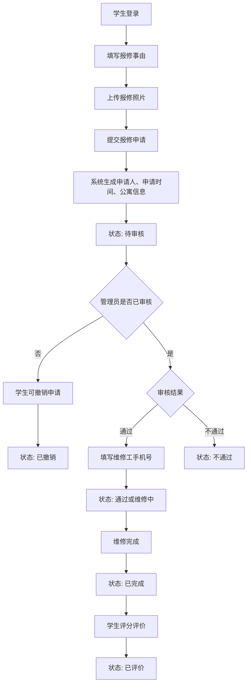
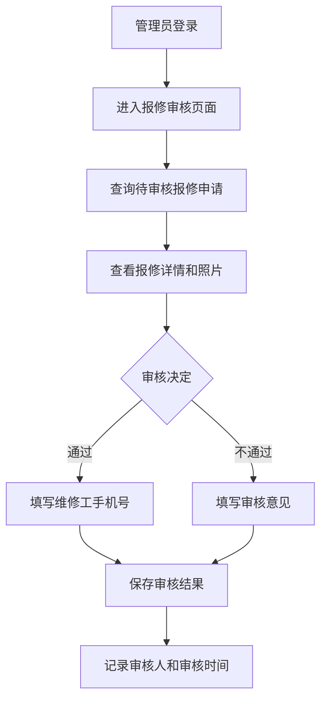
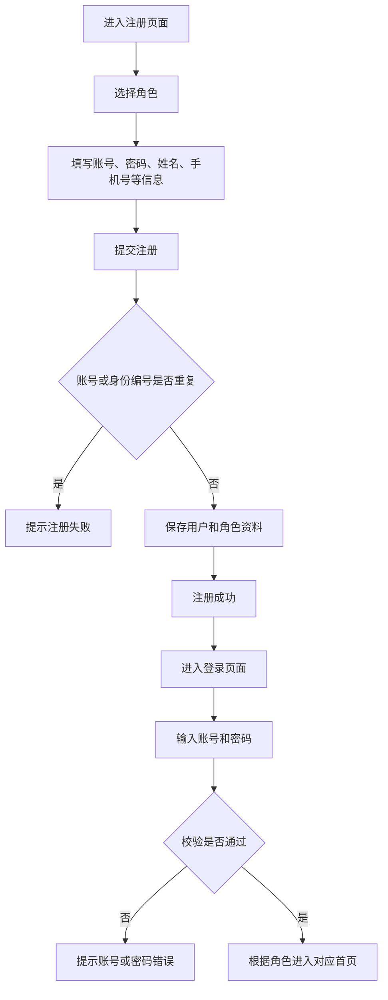
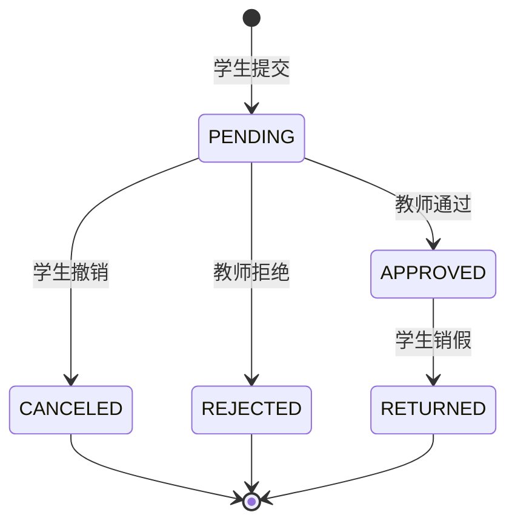
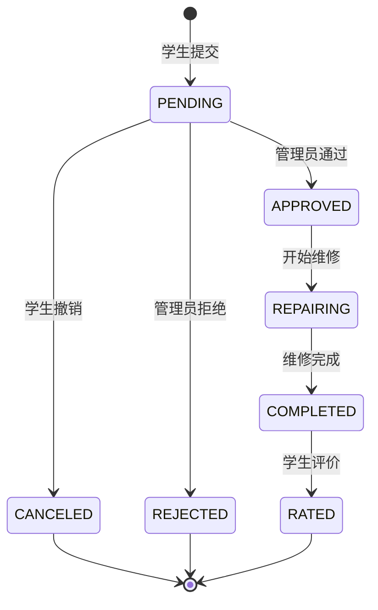

# CampusGo 用例图和流程图

## 1. 系统参与者

系统参与者包括：

- 游客：未登录用户，可浏览公告。
- 学生：提交请假和报修申请，维护个人信息。
- 教师：审核本学院学生请假申请。
- 管理员：管理公告，审核公寓报修申请。

## 2. 总体用例图

## 3. 公告管理用例

## 4. 请销假业务流程图

## 5. 教师审核请假流程图

## 6. 报修业务流程图

## 7. 管理员审核报修流程图

## 8. 登录注册流程图

## 9. 状态流转图

### 9.1 请假状态流转

### 9.2 报修状态流转

