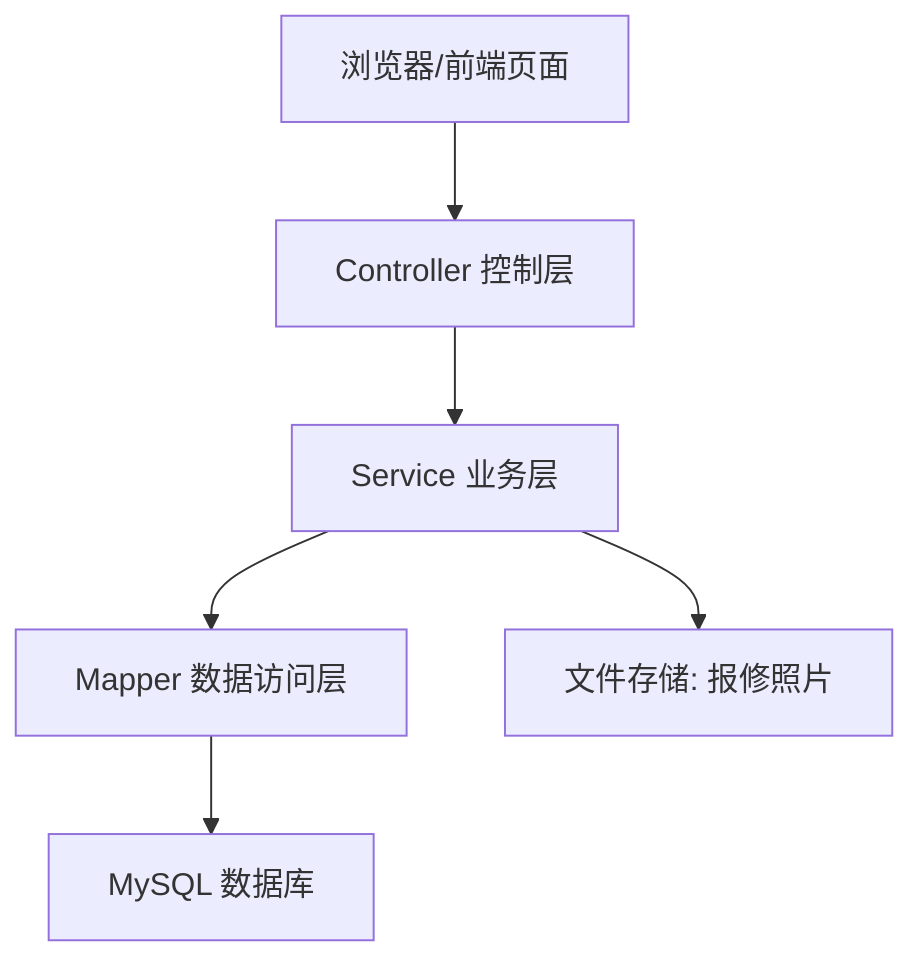

# CampusGo 系统概要设计

## 1. 设计目标

CampusGo 高校学生事务中心采用 Spring Boot + MyBatis + MySQL 技术路线，实现公告管理、用户管理、学生请销假、公寓报修等核心功能。系统设计目标如下：

- 支持游客、学生、教师、管理员四类角色访问。
- 通过统一登录认证和角色权限控制保证业务安全。
- 将公告、请假、报修等事务流程线上化。
- 采用清晰的分层架构，便于课程项目开发、测试和后续扩展。

## 2. 技术架构

建议技术选型：

| 层次 | 技术 |
| --- | --- |
| 后端框架 | Spring Boot 3 |
| Web 接口 | Spring MVC REST API |
| 数据访问 | MyBatis |
| 数据库 | MySQL |
| 构建工具 | Maven |
| 运行环境 | JDK 17 |
| 前端实现 | HTML、CSS、JavaScript，可结合 Bootstrap、Vue 或 Thymeleaf |
| 文件上传 | Spring MultipartFile |

## 3. 总体架构

系统采用典型 MVC 分层架构。



### 3.1 表现层

表现层负责页面展示、表单输入、数据校验提示、接口调用和结果渲染。

主要页面：

- 首页公告。
- 登录注册。
- 学生工作台。
- 教师工作台。
- 管理员工作台。
- 请假申请页面。
- 报修申请页面。

### 3.2 控制层

控制层负责接收 HTTP 请求、获取参数、调用业务层并返回结果。

建议 Controller：

- `AuthController`：登录、注册、退出。
- `UserController`：个人信息查询与修改。
- `AnnouncementController`：公告查询与管理。
- `LeaveController`：请假申请、撤销、审核、销假。
- `RepairController`：报修申请、撤销、审核、评价。
- `FileController`：图片上传和访问。

### 3.3 业务层

业务层负责核心业务规则和权限校验。

建议 Service：

- `AuthService`
- `UserService`
- `AnnouncementService`
- `LeaveService`
- `RepairService`
- `FileService`

业务层应重点处理：

- 用户角色判断。
- 申请状态流转。
- 教师只能审核本学院学生请假。
- 管理员审核报修时填写维修工手机号。
- 学生只能撤销和评价自己的申请。

### 3.4 数据访问层

数据访问层使用 MyBatis Mapper 完成数据库 CRUD。

建议 Mapper：

- `UserMapper`
- `StudentProfileMapper`
- `TeacherProfileMapper`
- `AdminProfileMapper`
- `AnnouncementMapper`
- `LeaveApplicationMapper`
- `RepairApplicationMapper`

## 4. 功能模块设计

### 4.1 用户认证模块

功能：

- 用户注册。
- 用户登录。
- 用户退出。
- 当前登录用户信息获取。
- 密码加密校验。

角色：

- 学生。
- 教师。
- 管理员。

设计说明：

- 登录成功后可使用 Session 保存用户信息，课程项目实现简单直观。
- 如果使用前后端分离，也可以使用 Token 方式。
- 后端接口必须检查当前用户角色，不能只依赖前端菜单隐藏。

### 4.2 公告模块

功能：

- 游客、学生、教师、管理员均可查询公告。
- 管理员可新增、修改、删除公告。

设计说明：

- 首页展示最近公告。
- 公告删除建议采用逻辑删除，避免误删数据。
- 公告列表按发布时间倒序。

### 4.3 学生请销假模块

功能：

- 学生提交请假申请。
- 学生在待审核时撤销申请。
- 教师查询本学院请假申请。
- 教师审核请假申请。
- 学生对通过的申请进行销假。

请假状态：

- `PENDING`：待审核。
- `APPROVED`：通过。
- `REJECTED`：不通过。
- `CANCELED`：已撤销。
- `RETURNED`：已销假。

设计说明：

- 申请人、学院、申请时间由系统自动填充。
- 教师查询时按教师学院过滤学生申请。
- 状态流转必须在后端校验。

### 4.4 公寓报修模块

功能：

- 学生提交报修申请并上传照片。
- 学生在待审核时撤销报修申请。
- 管理员查询报修申请。
- 管理员审核报修申请并填写维修工手机号。
- 维修完成后学生评分评价。

报修状态：

- `PENDING`：待审核。
- `APPROVED`：通过。
- `REJECTED`：不通过。
- `CANCELED`：已撤销。
- `REPAIRING`：维修中。
- `COMPLETED`：已完成。
- `RATED`：已评价。

设计说明：

- 报修照片保存到服务器本地目录，数据库保存访问路径。
- 若课程项目不开发维修工账号，可由管理员手动将状态更新为已完成。
- 学生只能评价自己的已完成报修申请。

## 5. 权限控制设计

| 资源 | 游客 | 学生 | 教师 | 管理员 |
| --- | --- | --- | --- | --- |
| 首页公告 | 可访问 | 可访问 | 可访问 | 可访问 |
| 登录注册 | 可访问 | 可访问 | 可访问 | 可访问 |
| 个人信息 | 不可访问 | 本人 | 本人 | 可选 |
| 公告管理 | 不可访问 | 不可访问 | 不可访问 | 可访问 |
| 请假申请 | 不可访问 | 本人申请 | 本学院审核 | 不可访问 |
| 报修申请 | 不可访问 | 本人申请 | 不可访问 | 审核管理 |

## 6. 异常处理设计

系统应统一返回错误信息。

常见异常：

- 未登录。
- 无权限。
- 参数为空。
- 数据不存在。
- 状态不允许操作。
- 文件上传失败。
- 数据库操作失败。

建议统一响应格式：

```json
{
  "code": 200,
  "message": "success",
  "data": {}
}
```

## 7. 包结构建议

```text
com.zane.campusgo
  ├─ controller
  ├─ service
  │   └─ impl
  ├─ mapper
  ├─ entity
  ├─ dto
  ├─ vo
  ├─ common
  ├─ config
  └─ exception
```

## 8. 部署设计

开发环境：

- JDK 17。
- Maven。
- MySQL 8。
- Spring Boot 内置 Tomcat。

部署步骤：

1. 创建 MySQL 数据库 `campusgo`。
2. 执行数据库建表脚本。
3. 修改 `application.yml` 数据库连接配置。
4. 使用 Maven 打包项目。
5. 运行 Spring Boot 应用。
