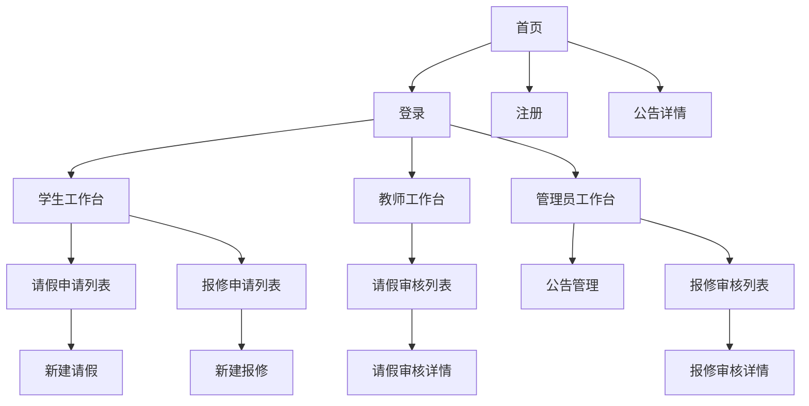

# CampusGo 页面原型设计

## 1. 设计风格定位

CampusGo 页面可模仿苹果官网的视觉风格：简洁、克制、清晰、有高级感。整体以大面积留白、清晰标题、柔和浅灰背景、圆角内容区、精致按钮和高质量图文层级为主。前端实现可使用 Bootstrap 技术，提高响应式布局、表单、按钮、导航栏、模态框和表格组件的开发效率；也可使用 Vue 技术管理页面状态、表单联动、列表渲染和接口交互。

设计关键词：

- 简洁清爽。
- 信息层级明确。
- 大标题和短文案。
- 轻量卡片式内容承载。
- 黑、白、浅灰为主色，蓝色作为主操作色。
- 页面动线清晰，减少冗余说明。

## 2. 全局视觉规范

### 2.1 色彩

| 用途 | 色值建议 | 说明 |
| --- | --- | --- |
| 页面背景 | `#f5f5f7` | 苹果官网常见浅灰背景 |
| 主内容背景 | `#ffffff` | 内容区和表单 |
| 主文字 | `#1d1d1f` | 标题和正文 |
| 次级文字 | `#6e6e73` | 辅助说明 |
| 主按钮 | `#0071e3` | 操作按钮 |
| 成功状态 | `#34c759` | 通过、完成 |
| 警告状态 | `#ff9f0a` | 待审核 |
| 错误状态 | `#ff3b30` | 不通过、错误 |

### 2.2 字体与间距

- 字体：优先使用系统字体，中文可使用 `Microsoft YaHei`。
- 页面最大宽度：`1200px`。
- 主标题字号：`40px` 到 `56px`。
- 页面标题字号：`28px` 到 `36px`。
- 正文字号：`14px` 到 `16px`。
- 卡片圆角：`18px` 到 `24px`。
- 按钮圆角：`999px`，形成胶囊按钮。

### 2.3 组件风格

- 顶部导航固定高度，透明或白色轻阴影。
- 按钮使用蓝色主按钮和浅灰次按钮。
- 表格使用轻边框、浅灰表头、状态标签。
- 表单输入框使用大圆角、浅灰边框。
- 详情页使用左右分栏或信息卡片组合。
- 可基于 Bootstrap 的 `container`、`row`、`col`、`navbar`、`card`、`table`、`modal`、`form-control`、`btn` 等组件进行二次样式定制。

### 2.4 风格一致性要求

- 所有页面必须共享同一套顶部导航、页面宽度、按钮、表单、状态标签、表格和卡片样式。
- 学生、教师、管理员页面只在业务内容和菜单项上区分，视觉语言保持一致。
- 公共样式集中在 `campusgo.css`，避免每个页面单独写不同颜色、圆角、阴影和间距。
- Vue 页面状态变化不应造成布局跳动，列表空状态、加载状态、错误提示也要保持同一视觉规范。
- 页面标题、操作按钮、筛选区、表格区的排列顺序在各模块中保持一致，降低使用成本。

## 3. 公共布局

### 3.1 顶部导航

```text
┌────────────────────────────────────────────────────────────┐
│ CampusGo     公告     请假     报修     个人中心     登录  │
└────────────────────────────────────────────────────────────┘
```

说明：

- 游客显示：CampusGo、公告、登录、注册。
- 学生显示：公告、请假、报修、个人中心、退出。
- 教师显示：公告、请假审核、个人中心、退出。
- 管理员显示：公告管理、报修审核、退出。

### 3.2 首页原型

```text
┌────────────────────────────────────────────────────────────┐
│ CampusGo                                                   │
│                                                            │
│        校园事务，一站抵达。                                │
│        公告查看、请假申请、公寓报修，让事务处理更轻。       │
│                                                            │
│        [登录]  [注册]                                      │
└────────────────────────────────────────────────────────────┘

┌────────────────────────────────────────────────────────────┐
│ 最新公告                                                   │
│ ┌──────────────┐ ┌──────────────┐ ┌──────────────┐         │
│ │ 端午假期安排 │ │ 宿舍检修通知 │ │ 教务系统维护 │         │
│ │ 2026-06-07   │ │ 2026-06-06   │ │ 2026-06-05   │         │
│ └──────────────┘ └──────────────┘ └──────────────┘         │
└────────────────────────────────────────────────────────────┘
```

设计说明：

- 首屏用大标题体现品牌感。
- 公告区域用三列卡片展示最新公告。
- 移动端公告卡片改为单列。

## 4. 登录注册页面

### 4.1 登录页

```text
┌──────────────────────────────────────────┐
│               CampusGo                   │
│        登录你的校园事务中心              │
│                                          │
│        账号  [________________]          │
│        密码  [________________]          │
│                                          │
│        [登录]                            │
│        还没有账号？注册                  │
└──────────────────────────────────────────┘
```

交互说明：

- 账号和密码不能为空。
- 登录失败提示“账号或密码错误”。
- 登录成功后按角色跳转。

### 4.2 注册页

```text
┌──────────────────────────────────────────┐
│               创建 CampusGo 账号         │
│                                          │
│        角色  [学生 ▼]                    │
│        账号  [________________]          │
│        密码  [________________]          │
│        姓名  [________________]          │
│        手机  [________________]          │
│        学院  [________________]          │
│        学号/工号/编号 [___________]      │
│                                          │
│        [注册]                            │
└──────────────────────────────────────────┘
```

交互说明：

- 切换角色时动态显示学生、教师、管理员特有字段。
- 学生显示专业、班级、宿舍。
- 教师显示职称、办公室。
- 管理员显示管理部门。

## 5. 学生端页面

### 5.1 学生工作台

```text
┌────────────────────────────────────────────────────────────┐
│ 你好，张同学                                               │
│                                                            │
│ ┌──────────────┐ ┌──────────────┐ ┌──────────────┐         │
│ │ 请假申请     │ │ 公寓报修     │ │ 我的信息     │         │
│ │ 2 条处理中   │ │ 1 条待评价   │ │ 完善资料     │         │
│ └──────────────┘ └──────────────┘ └──────────────┘         │
└────────────────────────────────────────────────────────────┘
```

### 5.2 请假申请列表

```text
┌────────────────────────────────────────────────────────────┐
│ 请假申请                                      [新建申请]   │
│ 状态 [全部 ▼]   时间 [开始] - [结束]                      │
│                                                            │
│ 理由        起止时间             状态       操作           │
│ 回家探亲    06-10 至 06-12       待审核     撤销/详情      │
│ 生病就医    06-01 至 06-02       通过       销假/详情      │
└────────────────────────────────────────────────────────────┘
```

### 5.3 新建请假申请

```text
┌──────────────────────────────────────────┐
│ 新建请假申请                             │
│ 理由 [______________________________]    │
│ 开始时间 [____-__-__ --:--]              │
│ 结束时间 [____-__-__ --:--]              │
│                                          │
│ [提交申请]  [取消]                       │
└──────────────────────────────────────────┘
```

### 5.4 报修申请列表

```text
┌────────────────────────────────────────────────────────────┐
│ 公寓报修                                      [新建报修]   │
│ 状态 [全部 ▼]   宿舍 [____]                              │
│                                                            │
│ 事由        宿舍       状态       维修工电话      操作     │
│ 水龙头漏水  3栋 502    待审核     -               撤销     │
│ 空调故障    3栋 502    已完成     138xxxx0000     评价     │
└────────────────────────────────────────────────────────────┘
```

### 5.5 新建报修申请

```text
┌──────────────────────────────────────────┐
│ 新建公寓报修                             │
│ 事由 [______________________________]    │
│ 照片 [上传照片]                          │
│                                          │
│ [提交报修]  [取消]                       │
└──────────────────────────────────────────┘
```

## 6. 教师端页面

### 6.1 教师工作台

```text
┌────────────────────────────────────────────────────────────┐
│ 请假审核                                                   │
│ 今日待审核 8 条      本周已处理 24 条                      │
└────────────────────────────────────────────────────────────┘
```

### 6.2 请假审核列表

```text
┌────────────────────────────────────────────────────────────┐
│ 本学院请假申请                                             │
│ 状态 [待审核 ▼]   学生 [________]                         │
│                                                            │
│ 学生       理由        起止时间            状态    操作     │
│ 李同学     就医        06-10 至 06-11      待审核  审核     │
└────────────────────────────────────────────────────────────┘
```

### 6.3 请假审核详情

```text
┌──────────────────────────────────────────┐
│ 请假详情                                 │
│ 学生：李同学                             │
│ 学院：计算机学院                         │
│ 理由：就医                               │
│ 时间：2026-06-10 至 2026-06-11           │
│ 审核意见 [________________________]      │
│                                          │
│ [通过]  [不通过]                         │
└──────────────────────────────────────────┘
```

## 7. 管理员端页面

### 7.1 管理员工作台

```text
┌────────────────────────────────────────────────────────────┐
│ 管理中心                                                   │
│ ┌──────────────┐ ┌──────────────┐                         │
│ │ 公告管理     │ │ 报修审核     │                         │
│ │ 12 条公告    │ │ 5 条待审核   │                         │
│ └──────────────┘ └──────────────┘                         │
└────────────────────────────────────────────────────────────┘
```

### 7.2 公告管理

```text
┌────────────────────────────────────────────────────────────┐
│ 公告管理                                      [新增公告]   │
│ 标题 [________________]                                      │
│                                                            │
│ 标题             发布时间          发布人        操作       │
│ 宿舍检修通知     2026-06-06        管理员        编辑/删除  │
└────────────────────────────────────────────────────────────┘
```

### 7.3 报修审核列表

```text
┌────────────────────────────────────────────────────────────┐
│ 报修审核                                                   │
│ 状态 [待审核 ▼]   宿舍 [____]                             │
│                                                            │
│ 学生       事由        宿舍        状态       操作          │
│ 王同学     灯管损坏    2栋 301     待审核     审核          │
└────────────────────────────────────────────────────────────┘
```

### 7.4 报修审核详情

```text
┌──────────────────────────────────────────┐
│ 报修详情                                 │
│ 学生：王同学                             │
│ 宿舍：2栋 301                            │
│ 事由：灯管损坏                           │
│ 照片：[图片预览]                         │
│ 维修工手机号 [________________]          │
│ 审核意见 [________________________]      │
│                                          │
│ [通过]  [不通过]                         │
└──────────────────────────────────────────┘
```

## 8. 响应式设计

- 桌面端采用顶部导航和多列卡片。
- 平板端卡片从三列变为两列。
- 手机端卡片、表格和表单改为单列。
- 表格在手机端可改为列表卡片，避免横向滚动过多。

## 9. 页面跳转关系


